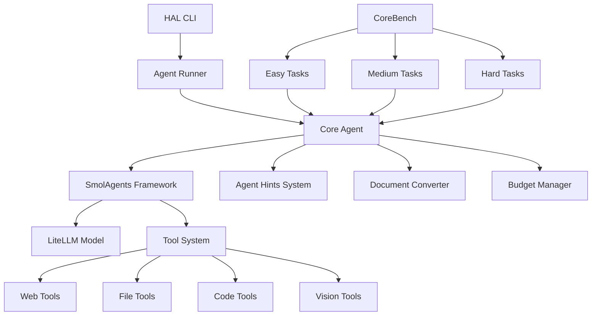
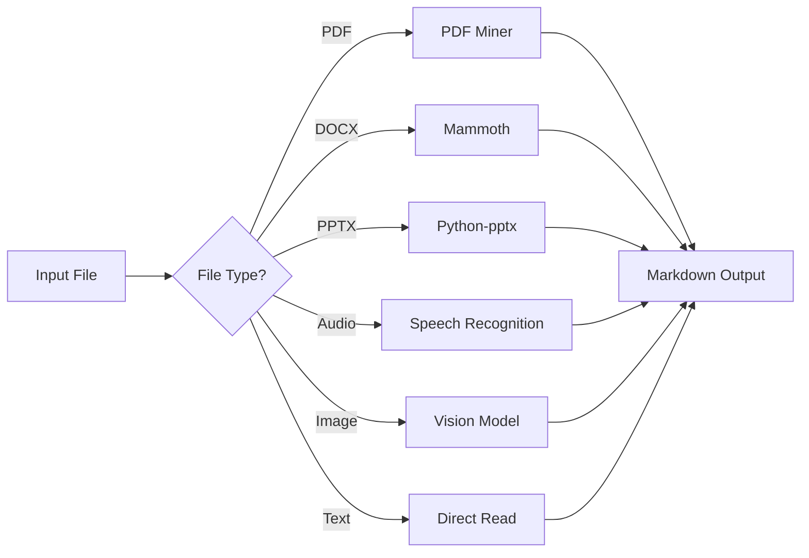

# Core Agent Architecture Documentation

## Overview

The Core Agent is a sophisticated AI research assistant built on the `smolagents` framework, designed specifically for scientific reproducibility tasks in the HAL (Harness for Agent Learning) evaluation system. It excels at analyzing research code, extracting results, and answering structured questions about scientific experiments.

## Table of Contents

1. [Architecture Overview](#architecture-overview)
2. [Core Components](#core-components)
3. [Tool System](#tool-system)
4. [Agent Types & Hints](#agent-types--hints)
5. [Integration with HAL Framework](#integration-with-hal-framework)
6. [Model Support](#model-support)
7. [File Processing Pipeline](#file-processing-pipeline)
8. [Usage Examples](#usage-examples)
9. [Configuration Options](#configuration-options)
10. [Development Guidelines](#development-guidelines)

## Architecture Overview



The Core Agent follows a modular architecture with clear separation of concerns:

- **Entry Point**: `main.py` contains the `run()` function that serves as the primary interface
- **Framework**: Built on `smolagents` for agent orchestration and tool management
- **Model Layer**: Uses `LiteLLM` for multi-provider LLM access
- **Tool System**: Comprehensive set of tools for research tasks
- **Hint System**: Context-aware prompts based on task difficulty
- **Document Processing**: Multi-format file conversion and analysis

## Core Components

### 1. Main Entry Point (`main.py`)

**Primary Function**: `run(input: dict[str, dict], **kwargs) -> dict[str, str]`

**Key Responsibilities**:
- Agent initialization and configuration
- Model parameter setup and provider handling
- Tool assembly and agent creation
- Task execution and result processing
- Budget monitoring and cost tracking

**Critical Features**:
- Multi-provider model support (OpenAI, Anthropic, Google, etc.)
- Budget management with token cost tracking
- Custom answer validation with key matching
- Giving-up detection using LLM-based analysis
- Symbolic link creation for environment access

### 2. Agent Hints System (`agent_hints.py`)

**Purpose**: Provides specialized prompts based on task difficulty and agent type.

**Agent Types**:
- `base`: No additional hints (minimal agent)
- `corebench_easy`: Basic research assistant with result directory access
- `corebench_medium`: Enhanced hints with manuscript reading capabilities
- `corebench_hard`: Advanced hints with dependency management

**Hint Structure**:
```python
AGENT_HINTS = {
    'agent_type': """
    • Role definition and capabilities
    • Best practices for the task type
    • Constraints and limitations
    • Specific instructions for the difficulty level
    """
}
```

### 3. Document Processing (`mdconvert.py`)

**Purpose**: Converts various file formats to markdown/text for analysis.

**Supported Formats**:
- **Documents**: PDF, DOCX, PPTX, HTML
- **Audio**: WAV, MP3, M4A, FLAC
- **Data**: Excel, CSV, JSON
- **Code**: Python, JavaScript, and other text files
- **Archives**: ZIP files (extraction and analysis)

**Key Classes**:
- `MarkdownConverter`: Main conversion engine
- `DocumentConverterResult`: Structured output format
- `_CustomMarkdownify`: Custom HTML to Markdown converter

### 4. Model Pricing (`model_prices.py`)

**Purpose**: Tracks token costs for budget management and cost optimization.

**Features**:
- Comprehensive model pricing database
- Support for multiple providers
- Cost calculation for budget enforcement
- Fallback for VM/Docker environments

## Tool System

The Core Agent provides a comprehensive set of tools organized into categories:

### Web & Search Tools
- **`DuckDuckGoSearchTool`**: Web search capabilities
- **`VisitWebpageTool`**: Web page browsing and content extraction

### File & Document Tools
- **`TextInspectorTool`**: Multi-format file reading and conversion
- **`edit_file`**: File creation, editing, and manipulation
- **`file_content_search`**: Content search across project files

### Code & Execution Tools
- **`PythonInterpreterTool`**: Python code execution with sandboxing
- **`execute_bash`**: Shell command execution

### Vision & Analysis Tools
- **`query_vision_language_model`**: Image analysis using vision models

### Answer Management
- **`CustomFinalAnswerTool`**: Structured answer validation and submission

### Tool Implementation Details

#### TextInspectorTool
```python
class TextInspectorTool(Tool):
    name = "inspect_file_as_text"
    description = "Read files as markdown text and ask questions"
    
    def forward(self, file_path, question=None):
        # Handles files without extensions as text
        # Converts various formats to markdown
        # Provides LLM-based analysis for complex questions
```

#### CustomFinalAnswerTool
```python
class CustomFinalAnswerTool(Tool):
    def forward(self, answer):
        # Validates answer format matches expected keys
        # Detects giving-up behavior using LLM analysis
        # Enforces structured output requirements
```

## Agent Types & Hints

### Base Agent (`base`)
- **Purpose**: Minimal agent without additional guidance
- **Use Case**: Baseline performance measurement
- **Hints**: None (pure model capabilities)

### Easy Agent (`corebench_easy`)
- **Purpose**: Research tasks with pre-computed results
- **Capabilities**: 
  - Result directory analysis
  - Image file processing
  - HTML to PDF conversion
- **Constraints**: No code execution required

### Medium Agent (`corebench_medium`)
- **Purpose**: Reproducibility tasks with partial guidance
- **Capabilities**:
  - Manuscript reading
  - Code reproduction with instructions
  - Result generation
- **Constraints**: Results directory removed, REPRODUCING.md available

### Hard Agent (`corebench_hard`)
- **Purpose**: Full reproducibility from scratch
- **Capabilities**:
  - Dependency installation
  - Complete code execution
  - Full environment setup
- **Constraints**: Minimal files provided, full reproduction required

## Integration with HAL Framework

### Benchmark Integration
The Core Agent integrates with HAL through the CoreBench benchmark system:

```python
# CoreBench hierarchy
CoreBench (Base)
├── CoreBenchEasy
├── CoreBenchMedium
└── CoreBenchHard
```

### Task Structure
```python
input = {
    "task_id": {
        "prompt": "Task description with expected output keys",
        "files": {"target_path": "source_path"},  # File mappings
        "gpu": False  # GPU requirement flag
    }
}
```

### Evaluation Process
1. **Task Loading**: CoreBench downloads and extracts research capsules
2. **File Filtering**: Difficulty-based file access control
3. **Agent Execution**: Core Agent processes the task
4. **Result Validation**: Structured output validation
5. **Scoring**: Prediction interval-based evaluation

## Model Support

### Supported Providers
- **OpenAI**: GPT-4o, GPT-4.1, o1, o3 series
- **Anthropic**: Claude-3.5-Sonnet, Claude-Opus-4
- **Google**: Gemini-1.5-Pro, Gemini-2.0-Flash
- **Together AI**: Various Llama models
- **Amazon Bedrock**: Nova and Claude models
- **OpenRouter**: Aggregated model access

### Model Configuration
```python
model_params = {
    'model_id': 'openai/gpt-4o-2024-11-20',
    'temperature': 0.7,
    'reasoning_effort': 'high',  # For reasoning models
    'api_key': 'your_api_key',    # Provider-specific
    'api_base': 'custom_endpoint' # For custom deployments
}
```

### Special Features
- **Reasoning Models**: Support for o1, o3 series with effort control
- **Provider Pinning**: OpenRouter provider selection
- **Budget Management**: Token cost tracking and limits
- **Stop Parameter**: Automatic detection and handling

## File Processing Pipeline

### Document Conversion Flow


### Processing Capabilities
- **Format Detection**: Automatic file type identification
- **Content Extraction**: Text, metadata, and structured data
- **Error Handling**: Graceful fallbacks for unsupported formats
- **Size Management**: Token limits and content truncation
- **Security**: Safe execution environment

## Usage Examples

### Basic Usage
```python
from main import run

# Define task
task = {
    "research_task_1": {
        "prompt": "Analyze the experiment results and provide accuracy metrics"
    }
}

# Run agent
results = run(
    input=task,
    model_name="openai/gpt-4o-2024-11-20",
    benchmark_name="corebench_medium",
    budget=5.0,
    temperature=0.7
)
```

### Advanced Configuration
```python
results = run(
    input=task,
    model_name="anthropic/claude-3-5-sonnet-20241022",
    benchmark_name="corebench_hard",
    budget=10.0,
    temperature=0.3,
    reasoning_effort="high",
    base_agent=False,  # Use hints
    openrouter_provider_only=["anthropic", "openai"]
)
```

### HAL CLI Usage
```bash
hal-eval \
    --benchmark corebench_medium \
    --agent_dir agents/core_agent/ \
    --agent_function main.run \
    --agent_name "Core Agent (gpt-4o)" \
    -A model_name=openai/gpt-4o-2024-11-20 \
    -A budget=5.0 \
    -A temperature=0.7 \
    --max_concurrent 3
```

## Configuration Options

### Required Parameters
- `model_name`: LLM model identifier
- `benchmark_name`: One of `corebench_easy`, `corebench_medium`, `corebench_hard`

### Optional Parameters
- `budget`: Cost limit in dollars (default: None)
- `temperature`: Model temperature (default: model default)
- `reasoning_effort`: For reasoning models (`low`, `medium`, `high`)
- `base_agent`: Use minimal agent without hints (default: False)
- `openrouter_provider_only`: Restrict OpenRouter providers

### Environment Variables
- `OPENAI_API_KEY`: OpenAI API key
- `ANTHROPIC_API_KEY`: Anthropic API key
- `GEMINI_API_KEY`: Google Gemini API key
- `TOGETHERAI_API_KEY`: Together AI API key

## Development Guidelines

### Adding New Tools
1. Create tool class inheriting from `Tool`
2. Implement `forward()` method
3. Add to `CORE_TOOLS` list
4. Update documentation

### Extending Agent Types
1. Add new agent type to `AGENT_HINTS`
2. Define appropriate hints and constraints
3. Update benchmark integration if needed
4. Test with sample tasks

### Model Integration
1. Add model pricing to `MODEL_PRICES_DICT`
2. Handle provider-specific parameters
3. Test with various model configurations
4. Update documentation

### Testing
- Use different difficulty levels
- Test with various file formats
- Verify budget management
- Check answer validation

## Performance Considerations

### Optimization Strategies
- **Token Management**: Efficient content truncation
- **Tool Selection**: Appropriate tool for task type
- **Parallel Execution**: Concurrent task processing
- **Caching**: Reuse converted documents when possible

### Resource Usage
- **Memory**: Document processing and model loading
- **CPU**: File conversion and code execution
- **Network**: Model API calls and file downloads
- **Storage**: Temporary files and result storage

### Monitoring
- **Cost Tracking**: Real-time budget monitoring
- **Performance Metrics**: Execution time and success rates
- **Error Handling**: Graceful failure recovery
- **Logging**: Comprehensive execution traces

## Troubleshooting

### Common Issues
1. **File Access Errors**: Check symbolic link creation
2. **Model API Failures**: Verify API keys and quotas
3. **Budget Exceeded**: Adjust limits or optimize prompts
4. **Answer Validation**: Ensure correct key format

### Debug Mode
Enable verbose logging for detailed execution traces:
```python
# Add to agent configuration
verbosity_level=2
```

### Error Recovery
- Automatic retry mechanisms
- Graceful degradation
- Detailed error reporting
- Fallback strategies

---

This documentation provides a comprehensive overview of the Core Agent architecture. For specific implementation details, refer to the source code and inline comments.
